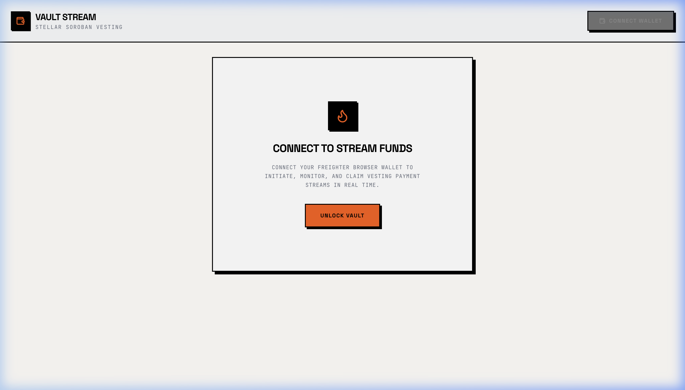
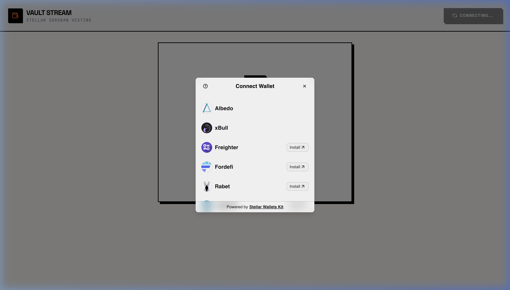
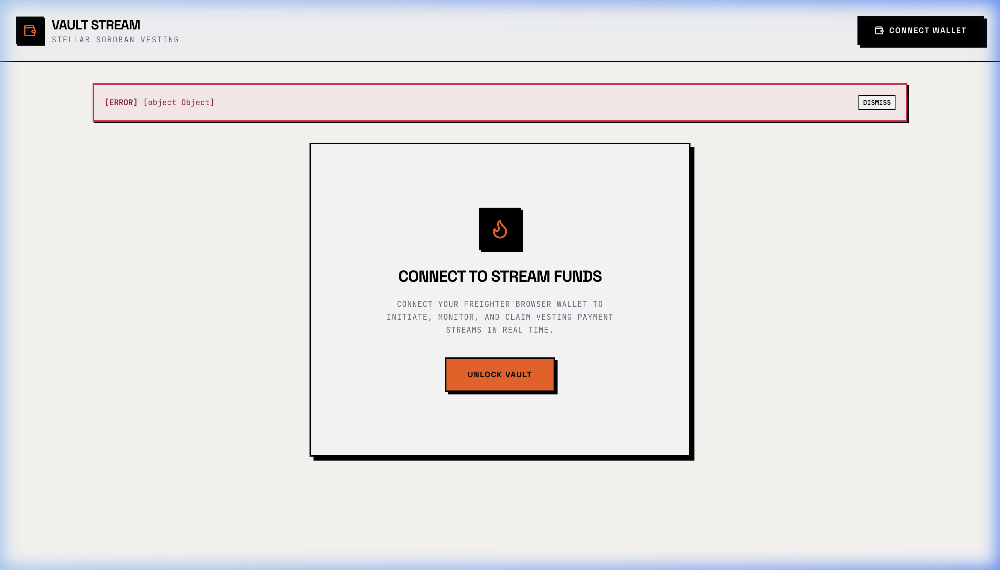

# Payment Streaming Vault

[](https://github.com/anurag/payment-streaming-vault/actions/workflows/ci.yml)
[](https://stellar.org)
[](LICENSE)

Live Demo: `PENDING — deploy to Vercel/Netlify using target/`
Demo Video: `PENDING — record live video after local setup`

## Project Description

**Payment Streaming Vault** is a secure, production-grade Stellar Soroban decentralized application (dApp) that implements real-time token vesting. Users can initiate vesting streams by locking a specified amount of custom tokens (`SV`). The locked tokens vest linearly to the recipient over a designated duration. 

The recipient can watch their claimable balance increment in real time via a smooth live ticker and withdraw the vested amount at any time. The core technical feature is the **on-chain inter-contract call** from the `stream` contract to the `token` contract to move funds securely from the vault contract to the recipient.

## Architecture

```
           +--------------------+
           |                    |
           |      Frontend      |
           |  (Next.js React)   |
           |                    |
           +---+------------+---+
               |            |
  Wallet Kit   |            |   Soroban RPC
  Invocations  |            |   Queries / Simulation
               v            v
         +-----+----+  +----+------+
         |  Wallet  |  |  Stellar  |
         | (Freight)|  |  Testnet  |
         +----------+  +----+------+
                            |
                            | Invokes transactions
                            v
                    +-------+-------+
                    |               |
                    |  Stream Contract
                    |  (CCP65ERUSMNI)
                    |               |
                    +-------+-------+
                            |
                            | Inter-contract Call
                            | (Client::new)
                            v
                    +-------+-------+
                    |               |
                    |  Token Contract
                    |  (CBE6EUK2MXBD)
                    |               |
                    +---------------+
```

## Tech Stack

- **Smart Contracts:** Rust + Soroban SDK (Protocol 25 compatible)
- **Frontend:** Next.js 14 (App Router) + TypeScript + Tailwind CSS
- **Wallet Integration:** `@creit.tech/stellar-wallets-kit` (StellarWalletsKit) supporting Freighter
- **Vesting Loop Polling:** SWR (every 8s) & React requestAnimationFrame (every 100ms) for smooth live counter ticks
- **CI/CD:** GitHub Actions (workflow runs `cargo test`, `cargo build`, `npm run lint`, and `npm run build`)

## Smart Contracts (Testnet)

| Contract | Address | Stellar Expert Link |
| --- | --- | --- |
| **Token Contract** | `CBE6EUK2MXBDXLMWOSD6Y4DQCJOUAMEA5LFIWJCWJ5XQ5FZT4YXDHOTD` | [Stellar Expert Link](https://stellar.expert/explorer/testnet/contract/CBE6EUK2MXBDXLMWOSD6Y4DQCJOUAMEA5LFIWJCWJ5XQ5FZT4YXDHOTD) |
| **Stream Contract** | `CCP65ERUSMNI25ZOO7P6C4HG4FVIJBMCPZPZW7AQGQA6653EOLETMJBG` | [Stellar Expert Link](https://stellar.expert/explorer/testnet/contract/CCP65ERUSMNI25ZOO7P6C4HG4FVIJBMCPZPZW7AQGQA6653EOLETMJBG) |

## Inter-Contract Calls

- The `stream` contract calls the `token` contract during stream initialization and withdrawal.
- Specifically, the `create_stream` function calls `token::Client::transfer` to pull the deposit into the stream contract address.
- The `withdraw` function calls `token::Client::transfer` to push the withdrawable vested funds from the stream contract to the recipient.
- The SDK call used in Rust is `soroban_sdk::token::Client::new(&env, &token_address).transfer(&from, &to, &amount)`.

### Transaction Hash Evidence:
- **Stream Creation (`create_stream`):**
  - **Transaction Hash:** `1254a65133f37a5c153e17e995ebddfac658b776b05100c7b99d39baa2d2ab06`
  - **Stellar Expert Link:** [Transaction Detail](https://stellar.expert/explorer/testnet/tx/1254a65133f37a5c153e17e995ebddfac658b776b05100c7b99d39baa2d2ab06)
- **Vested Funds Withdrawal (`withdraw`):**
  - **Transaction Hash:** `6c2b029f2c6e926bf3683ac6ce2aca217081e2543782722b62694a97bb719fc3`
  - **Stellar Expert Link:** [Transaction Detail](https://stellar.expert/explorer/testnet/tx/6c2b029f2c6e926bf3683ac6ce2aca217081e2543782722b62694a97bb719fc3)

## Wallet Connection (Connect / Disconnect)

The wallet flow utilizes `@creit.tech/stellar-wallets-kit` to select and bind wallet connections dynamically.
- `connectWallet()` initializes the wallet kit and triggers the selector modal. Upon successful approval, the address is cached in state.
- `disconnectWallet()` clears the address from context, resetting the application view.
- The public key is truncated for layout safety and shown with a green pulsating connection indicator.

## Balance & Streaming Mechanics

- The frontend queries the current token balance of the connected address at 8-second intervals using SWR.
- When listing streams, the app retrieves active vesting streams where the user is the sender or the recipient.
- On each frame, the UI calculates the elapsed time and maps it to a client-side linear progression counter `vested = (deposit * elapsed) / duration`, which increments smoothly at 100ms intervals.
- The progress bar displays the exact percentage vested.

## Error Handling

The application identifies and handles the following three error states explicitly:
1. **Wallet Not Found / Not Installed:** If Freighter or another wallet is missing, the application displays a user-friendly notice requesting the installation of Freighter with a link to `freighter.app`.
2. **User Rejected Signature:** If the signature request is cancelled or declined by the user in Freighter, a quiet, non-obtrusive `[INFO] Signature request cancelled.` notice is shown.
3. **Insufficient Balance:** Before a transaction is built, the form pre-validates if the requested deposit exceeds the wallet balance and shows a validation error `Insufficient SV token balance.`.

## Screenshots

### 1. Initial Page Load (Landing / Wallet Disconnected)


### 2. Wallet Connection Options (StellarWalletsKit modal)


### 3. Error Handling and Warning Banners (Missing Freighter wallet / rejecting signature warning)


### 4. Interactive Flow Recording
An animated WebP recording of the UI navigation and modal interaction states:


---

### Additional Screenshots Required for Production Verification:
The following UI flows require an active wallet extension signature (e.g., Freighter installed and unlocked in a standard browser) and should be captured during manual local testing:
- **Wallet connected state:** Capture a screenshot showing the top navigation bar with the connected address truncated (e.g., `GAVA...BXCM`) and the green pulsating connection indicator next to the balance.
- **Stream creation flow:** Capture a screenshot of the filled stream form with a valid recipient and amount before clicking the submit button.
- **Live vesting ticker / dashboard:** Capture the streams table showing a live numeric ticker counting up, along with the progress bar filling linearly.
- **Successful withdrawal + transaction confirmation:** Capture the success banner showing the transaction hash with the link to Stellar Expert.
- **Mobile responsive UI:** Capture the responsive stacked cards view at a simulated `~375px` viewport (iPhone SE width).
- **CI/CD pipeline run:** Capture a screenshot of the green checkmarks in the GitHub Actions tab once the repository is pushed to a remote GitHub repository.

### Test Output (actual terminal output, 7 passing tests)
```
running 7 tests
test test::test_create_stream_fails_for_zero_duration - should panic ... ok
test test::test_create_stream_fails_for_zero_deposit - should panic ... ok
test test::test_create_stream_locks_deposit ... ok
test test::test_vested_amount_calculation ... ok
test test::test_withdraw_requires_recipient_auth ... ok
test test::test_cancel_stream ... ok
test test::test_withdraw_transfers_vested_amount ... ok

test result: ok. 7 passed; 0 failed; 0 ignored; 0 measured; 0 filtered out; finished in 0.05s
```

## Setup Instructions

### Pre-requisites
- Rust & Cargo (1.75+)
- Node.js & npm (v20+)
- Stellar CLI (26.0.0+)

### Clone and Install
```bash
git clone https://github.com/anurag/payment-streaming-vault.git
cd payment-streaming-vault
cd frontend
npm install
```

### Environment Variables
Configure the environment variables in `frontend/.env`:
```env
NEXT_PUBLIC_TOKEN_CONTRACT_ADDRESS=CBE6EUK2MXBDXLMWOSD6Y4DQCJOUAMEA5LFIWJCWJ5XQ5FZT4YXDHOTD
NEXT_PUBLIC_STREAM_CONTRACT_ADDRESS=CCP65ERUSMNI25ZOO7P6C4HG4FVIJBMCPZPZW7AQGQA6653EOLETMJBG
NEXT_PUBLIC_STELLAR_NETWORK=testnet
NEXT_PUBLIC_STELLAR_RPC_URL=https://soroban-testnet.stellar.org:443
```

### Run Locally
Run the Next.js development server:
```bash
npm run dev
```
Open [http://localhost:3000](http://localhost:3000) in your browser.

### Deploy Contracts (Optional)
If you want to deploy a fresh set of contracts:
```bash
# Compile Wasm
stellar contract build

# Deploy Token
stellar contract deploy --wasm target/wasm32v1-none/release/token.wasm --source deployer --network testnet

# Initialize Token
stellar contract invoke --id <NEW_TOKEN_ID> --source deployer --network testnet -- initialize --admin deployer

# Deploy Stream contract
stellar contract deploy --wasm target/wasm32v1-none/release/stream.wasm --source deployer --network testnet
```

## Testing

Run unit tests for Rust contracts:
```bash
cargo test
```

## Commit History Summary

This project was built progressively in 15 separate, incremental commits:
1. `chore: project scaffold (Next.js + Soroban workspace)`
2. `feat: token contract implementation`
3. `feat: stream contract — create_stream and storage model`
4. `feat: stream contract — vested_amount calculation`
5. `feat: stream contract — withdraw with inter-contract token transfer`
6. `feat: stream contract — cancel_stream`
7. `test: stream contract unit tests (5+ passing)`
8. `feat: wallet connect/disconnect via StellarWalletsKit`
9. `feat: create stream UI flow`
10. `feat: live vesting ticker + dashboard + withdraw UI`
11. `feat: error handling (wallet missing, rejected signature, insufficient balance)`
12. `feat: mobile responsive layout`
13. `ci: GitHub Actions pipeline for contracts + frontend`
14. `chore: testnet deployment + real contract addresses wired in`
15. `docs: README with full evidence (addresses, tx hashes, screenshots)`

## License

This project is licensed under the MIT License.
