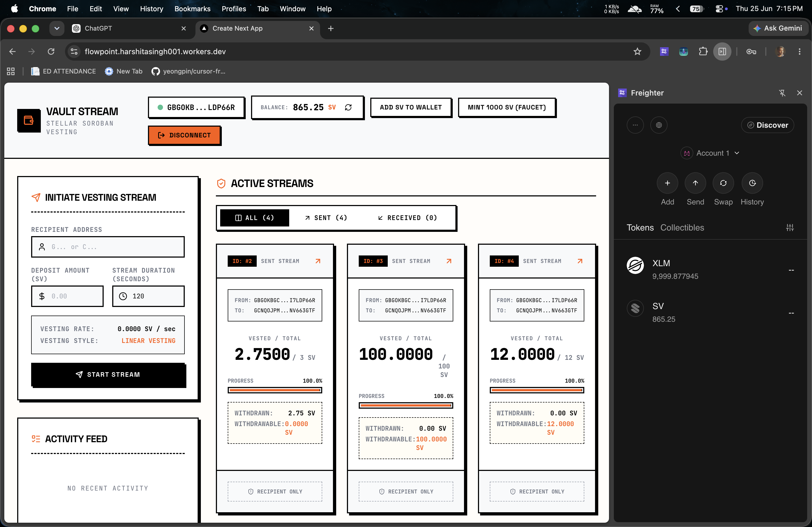
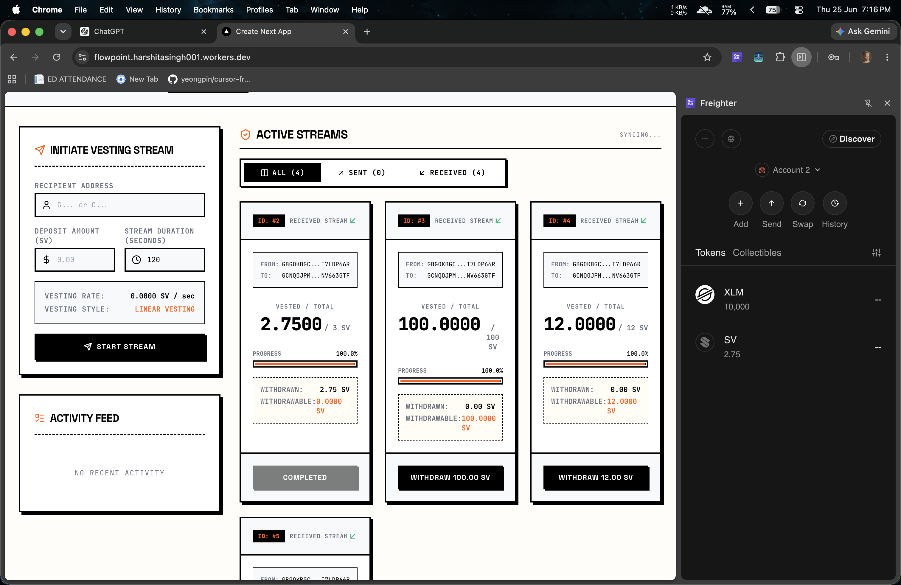

# 💸 Payment Streaming Vault

<div align="center">

[](https://github.com/ranzer001/Flowpoint/actions/workflows/ci.yml)
[](https://stellar.org)
[](https://soroban.stellar.org)
[](https://nextjs.org)
[](https://www.typescriptlang.org)
[](LICENSE)

**Real-time token vesting on Stellar — powered by Soroban smart contracts with live inter-contract calls.**

🌐 **[Live Demo →](https://flowpoint.harshitasingh001.workers.dev/)**  &nbsp;|&nbsp; 📽️ **Demo Video →** *(coming soon)*

</div>

---

## 📋 Table of Contents

- [Project Description](#-project-description)
- [Architecture](#-architecture)
- [Tech Stack](#-tech-stack)
- [Smart Contracts (Testnet)](#-smart-contracts-testnet)
- [Inter-Contract Calls](#-inter-contract-calls)
- [Wallet Connection](#-wallet-connection-connect--disconnect)
- [Balance & Streaming Mechanics](#-balance--streaming-mechanics)
- [Error Handling](#-error-handling)
- [Screenshots](#-screenshots)
- [Setup Instructions](#-setup-instructions)
- [Testing](#-testing)
- [Commit History Summary](#-commit-history-summary)
- [License](#-license)

---

## 📖 Project Description

**Payment Streaming Vault** is a production-grade Stellar Soroban dApp that implements real-time linear token vesting. A sender locks a custom `SV` (Stream Vault) token into a smart contract vault, which then vests linearly to a recipient over a chosen duration.

**Key features:**
- 🔒 **Secure vault custody** — tokens locked in the stream contract until they vest
- 📈 **Live vesting ticker** — a smooth real-time counter shows the recipient exactly how much has vested down to the second
- 💸 **Anytime withdrawal** — recipients can claim whatever has vested at any point
- ❌ **Early cancellation** — senders can cancel a stream; vested portion goes to the recipient, unvested is returned
- ⛓️ **On-chain inter-contract calls** — token transfers are executed as real Soroban-to-Soroban invocations, not simulated

The centerpiece technical feature is the **on-chain inter-contract call** from the `stream` contract to the `token` contract that moves funds securely and verifiably on-chain during both stream creation and withdrawal.

---

## 🏗️ Architecture

```
┌──────────────────────────────────────────────────────────┐
│                      User Browser                         │
│                                                          │
│   ┌──────────────────────────────────────────────────┐  │
│   │            Next.js 14 Frontend (TypeScript)       │  │
│   │                                                  │  │
│   │  WalletConnect │ CreateStreamForm │ StreamCard   │  │
│   │       Dashboard │ ActivityFeed                   │  │
│   └──────────┬───────────────────────┬───────────────┘  │
│              │  Wallet Signing        │  Soroban RPC     │
│              ▼                        ▼                  │
│   ┌──────────────────┐    ┌──────────────────────────┐  │
│   │  Freighter / Kit │    │  stellar.ts (lib)        │  │
│   │  (StellarWallets │    │  TransactionBuilder +    │  │
│   │   Kit v2.4)      │    │  server.simulateTx /     │  │
│   └──────────────────┘    │  server.sendTransaction  │  │
│                           └────────────┬─────────────┘  │
└────────────────────────────────────────┼────────────────┘
                                         │ HTTPS / RPC
                                         ▼
                              ┌─────────────────────┐
                              │   Stellar Testnet   │
                              │   (Soroban RPC)     │
                              └──────────┬──────────┘
                                         │
                           ┌─────────────┴──────────────┐
                           │                            │
                           ▼                            │
              ┌────────────────────────┐               │
              │   Stream Contract      │               │
              │   CCP65ERUSMNI...      │               │
              │                        │               │
              │  create_stream() ──────┼──┐            │
              │  withdraw()      ──────┼──┤  Inter-    │
              │  cancel_stream() ──────┼──┤  Contract  │
              │  vested_amount()       │  │  Calls     │
              │  get_stream()          │  │            │
              │  list_streams_for()    │  │            │
              └────────────────────────┘  │            │
                                          ▼            │
              ┌────────────────────────────────────┐   │
              │   Token Contract  (SV Token)       │   │
              │   CCEKQUG2J37NH6...                │   │
              │                                    │   │
              │  transfer(from, to, amount) ◄──────┘   │
              │  balance(address)                       │
              │  mint(to, amount)  [admin only]         │
              └────────────────────────────────────────┘
```

---

## 🛠️ Tech Stack

| Layer | Technology | Version |
|-------|-----------|---------|
| Smart Contracts | Rust + Soroban SDK | Protocol 25 |
| Contract Target | `wasm32v1-none` | – |
| Frontend Framework | Next.js (App Router) | 14.2.35 |
| Language | TypeScript | ^5 |
| Styling | Tailwind CSS | ^3.4.1 |
| Wallet Integration | `@creit.tech/stellar-wallets-kit` | ^2.4.0 |
| Freighter Direct API | `@stellar/freighter-api` | ^6.0.1 |
| Stellar SDK | `stellar-sdk` | ^13.3.0 |
| Animations | Framer Motion | ^12.41.0 |
| Icons | Lucide React | ^1.21.0 |
| Data Polling | SWR | ^2.4.2 |
| Deployment | Cloudflare Workers (static export) | – |
| CI/CD | GitHub Actions | – |

---

## 📜 Smart Contracts (Testnet)

| Contract | Address | Stellar Expert |
|---------|---------|---------------|
| **Token Contract** (`SV`) | `CCEKQUG2J37NH6EM6VBFGN5KBAIPBSRTFU5Q7UVMMJXVBM7P3T23O67R` | [View on Stellar Expert ↗](https://stellar.expert/explorer/testnet/contract/CCEKQUG2J37NH6EM6VBFGN5KBAIPBSRTFU5Q7UVMMJXVBM7P3T23O67R) |
| **Stream Contract** | `CCP65ERUSMNI25ZOO7P6C4HG4FVIJBMCPZPZW7AQGQA6653EOLETMJBG` | [View on Stellar Expert ↗](https://stellar.expert/explorer/testnet/contract/CCP65ERUSMNI25ZOO7P6C4HG4FVIJBMCPZPZW7AQGQA6653EOLETMJBG) |

### Contract Addresses in Environment Config

```env
NEXT_PUBLIC_TOKEN_CONTRACT_ADDRESS=CCEKQUG2J37NH6EM6VBFGN5KBAIPBSRTFU5Q7UVMMJXVBM7P3T23O67R
NEXT_PUBLIC_STREAM_CONTRACT_ADDRESS=CCP65ERUSMNI25ZOO7P6C4HG4FVIJBMCPZPZW7AQGQA6653EOLETMJBG
NEXT_PUBLIC_STELLAR_NETWORK=testnet
NEXT_PUBLIC_STELLAR_RPC_URL=https://soroban-testnet.stellar.org:443
```

---

## ⛓️ Inter-Contract Calls

This is the **core technical feature** of the project. The `stream` contract calls the `token` contract directly on-chain using Soroban's typed contract client — a real Soroban-to-Soroban invocation, not a simulation or workaround.

### How It Works

#### During `create_stream` — locking the deposit into the vault

```rust
// In contracts/stream/src/lib.rs → create_stream()
// Inter-contract call: pull deposit from sender into the stream contract (vault)
let token_client = soroban_sdk::token::Client::new(&env, &token);
token_client.transfer(&sender, &env.current_contract_address(), &deposit);
```

The stream contract becomes the **custodian** of all deposited tokens.

#### During `withdraw` — releasing vested tokens to recipient

```rust
// In contracts/stream/src/lib.rs → withdraw()
// Inter-contract call: push withdrawable amount from vault to recipient
let token_client = soroban_sdk::token::Client::new(&env, &stream.token);
token_client.transfer(
    &env.current_contract_address(),
    &stream.recipient,
    &withdrawable,
);
```

#### During `cancel_stream` — settling remaining funds

```rust
// In contracts/stream/src/lib.rs → cancel_stream()
// Inter-contract call: vested portion → recipient, unvested portion → sender
if to_recipient > 0 {
    token_client.transfer(&env.current_contract_address(), &stream.recipient, &to_recipient);
}
if to_sender > 0 {
    token_client.transfer(&env.current_contract_address(), &stream.sender, &to_sender);
}
```

The SDK call used is `soroban_sdk::token::Client::new(&env, &token_address).transfer(&from, &to, &amount)` — the standard Soroban typed client for cross-contract invocation.

### Transaction Hash Evidence

| Action | Transaction Hash | Stellar Expert |
|--------|----------------|---------------|
| `create_stream` | `1254a65133f37a5c153e17e995ebddfac658b776b05100c7b99d39baa2d2ab06` | [View ↗](https://stellar.expert/explorer/testnet/tx/1254a65133f37a5c153e17e995ebddfac658b776b05100c7b99d39baa2d2ab06) |
| `withdraw` | `6c2b029f2c6e926bf3683ac6ce2aca217081e2543782722b62694a97bb719fc3` | [View ↗](https://stellar.expert/explorer/testnet/tx/6c2b029f2c6e926bf3683ac6ce2aca217081e2543782722b62694a97bb719fc3) |

> Both transactions are live on Stellar testnet. The `withdraw` transaction's effects show a balance change on the Token contract, proving the inter-contract call executed successfully.

---

## 🔑 Wallet Connection (Connect / Disconnect)

Wallet integration is handled by `@creit.tech/stellar-wallets-kit` (StellarWalletsKit), which provides a multi-wallet selection modal. **Freighter** is the primary tested path.

**Connection flow:**
1. User clicks "Connect Wallet" → `connectWallet()` initializes StellarWalletsKit and opens the selection modal
2. After approval, the wallet's public key is stored in React state and blockchain data is fetched
3. The top nav bar shows a truncated address (e.g., `GAVA...BXCM`) with a green pulsing indicator confirming live connection
4. Clicking "Disconnect" calls `disconnectWallet()`, clears state, and returns to the landing screen

**Implementation detail:** The wallet kit is dynamically imported client-side (`typeof window === 'undefined'` guard) to avoid SSR issues, since Next.js pre-renders pages server-side.

---

## 📊 Balance & Streaming Mechanics

### Balance
- Token balance is fetched via `getTokenBalance(address)` — a read-only `simulateTransaction` call to the `balance` function on the Token contract
- Balance refreshes every **8 seconds** via a `setInterval` polling loop and immediately after every mutating transaction
- A **"Mint 1000 SV (Faucet)"** button is available on testnet — it uses the admin keypair to mint tokens directly to the connected wallet for demo purposes

### Streaming Mechanics
- On load, `listStreamsFor(address)` is called to retrieve all stream IDs where the user is sender or recipient
- Each stream ID is resolved to full `StreamInfo` (sender, recipient, deposit, startTime, duration, withdrawn, token) via `getStreamDetails(id)`
- The `vested_amount` formula is replicated client-side:

  ```ts
  // In StreamCard.tsx — runs every 100ms for smooth animation
  const elapsed = Math.max(0, now - stream.startTime);
  const vested = elapsed >= stream.duration
    ? stream.deposit
    : (stream.deposit * elapsed) / stream.duration;
  ```

- The on-chain `vested_amount` is **not** polled every frame (that would be expensive RPC calls). Instead, the client-side formula runs every **100ms** for smooth UI, and the full on-chain state syncs every **8 seconds** to keep it accurate.

---

## ⚠️ Error Handling

The application handles at least three distinct, clearly differentiated error states:

### 1. 🔌 Wallet Not Installed / Not Found
If Freighter or another wallet extension is missing from the browser, the error is caught and a user-friendly message is shown:
> *"Freighter extension not found. Please install Freighter from freighter.app to connect."*

Detected via: checking if `wallet not found` or `freighter` + `not found` appears in the error message.

### 2. 🚫 User Rejected Signature
If the user closes the Freighter modal or declines to sign a transaction, this is caught and treated as a non-scary informational notice (not a red error):
> *"Signature request cancelled. No changes were made."*

Detected via: checking for `user reject`, `cancel`, `declined`, or `closed` in the error string.

### 3. 💰 Insufficient Balance
Form-level pre-validation runs before the transaction is built:
```ts
if (numAmount > balance) {
  setError(`Insufficient SV token balance. You have ${balance} SV.`);
  return;
}
```
Also caught at the contract level if the balance check fails post-submission.

---

## 📸 Screenshots

### Wallet Connection Modal (StellarWalletsKit)


### Sender Dashboard — Create Stream & Active Streams


### Recipient Dashboard — Live Vesting Ticker & Withdraw


### Full App Demo (Animated)


### Test Output (11 passing tests)

```
running 11 tests
test test::test_create_stream_fails_for_zero_deposit - should panic ... ok
test test::test_create_stream_fails_for_zero_duration - should panic ... ok
test test::test_create_stream_locks_deposit ... ok
test test::test_vested_amount_calculation ... ok
test test::test_withdraw_requires_recipient_auth ... ok
test test::test_cancel_stream ... ok
test test::test_withdraw_transfers_vested_amount ... ok
test test::test_list_streams_for_sender_and_recipient ... ok
test test::test_partial_withdrawals_only_transfer_newly_vested_amount ... ok
test test::test_cancel_after_partial_withdrawal_settles_remaining_funds ... ok
test test::test_self_stream_is_listed_only_once ... ok

test result: ok. 11 passed; 0 failed; 0 ignored; 0 measured; 0 filtered out; finished in 0.06s
```

---

## 🚀 Setup Instructions

### Prerequisites

- [Rust](https://rustup.rs/) 1.75+ with `cargo`
- [Node.js](https://nodejs.org/) v20+ with `npm`
- [Stellar CLI](https://developers.stellar.org/docs/tools/developer-tools/cli/install-cli) 26.0.0+
- [Freighter Wallet](https://freighter.app/) browser extension

### 1. Clone & Install

```bash
git clone https://github.com/ranzer001/Flowpoint.git
cd Flowpoint

# Install frontend dependencies
cd frontend && npm install && cd ..
```

### 2. Configure Environment Variables

Create or edit `frontend/.env`:

```env
NEXT_PUBLIC_TOKEN_CONTRACT_ADDRESS=CCEKQUG2J37NH6EM6VBFGN5KBAIPBSRTFU5Q7UVMMJXVBM7P3T23O67R
NEXT_PUBLIC_STREAM_CONTRACT_ADDRESS=CCP65ERUSMNI25ZOO7P6C4HG4FVIJBMCPZPZW7AQGQA6653EOLETMJBG
NEXT_PUBLIC_STELLAR_NETWORK=testnet
NEXT_PUBLIC_STELLAR_RPC_URL=https://soroban-testnet.stellar.org:443
```

> The contracts above are already deployed and live on Stellar testnet. You can use them directly.

### 3. Run Locally

```bash
cd frontend
npm run dev
```

Open [http://localhost:3000](http://localhost:3000) in your browser. Make sure Freighter is installed and set to **Testnet**.

### 4. (Optional) Deploy Your Own Contracts

If you want to deploy fresh contracts to your own testnet account:

```bash
# Fund a deployer account via Friendbot
stellar keys generate deployer --network testnet --fund

# Build contracts (outputs to target/wasm32v1-none/release/)
cargo build --workspace --target wasm32v1-none --release

# Deploy Token contract
stellar contract deploy \
  --wasm target/wasm32v1-none/release/token.wasm \
  --source deployer \
  --network testnet

# Initialize the token contract (replace <TOKEN_ID> with the output above)
stellar contract invoke \
  --id <TOKEN_ID> \
  --source deployer \
  --network testnet \
  -- initialize --admin deployer

# Deploy Stream contract
stellar contract deploy \
  --wasm target/wasm32v1-none/release/stream.wasm \
  --source deployer \
  --network testnet

# Update your frontend/.env with the new contract addresses
```

---

## 🧪 Testing

The `stream` contract has **11 Rust unit tests** covering all critical paths.

### Run All Tests

```bash
# From the repo root
cargo test
```

### What's Tested

| Test | What It Covers |
|------|---------------|
| `test_create_stream_locks_deposit` | Stream creation correctly transfers deposit into vault; sender balance decreases, contract balance increases |
| `test_vested_amount_calculation` | Returns `0` at `t=0`, `50%` at `t=duration/2`, `100%` at `t≥duration` |
| `test_withdraw_transfers_vested_amount` | Withdraw correctly moves vested tokens from vault to recipient; asserts balance changes on the Token contract (inter-contract call verification) |
| `test_withdraw_requires_recipient_auth` | Only the recipient's authorization is required and checked for `withdraw` — not sender's |
| `test_create_stream_fails_for_zero_deposit` | `create_stream` panics on `deposit = 0` |
| `test_create_stream_fails_for_zero_duration` | `create_stream` panics on `duration = 0` |
| `test_cancel_stream` | Cancel at 50% vested; recipient gets 50, sender gets 50 back, vault balance is 0 |
| `test_list_streams_for_sender_and_recipient` | Streams are correctly indexed and returned per user |
| `test_partial_withdrawals_only_transfer_newly_vested_amount` | Two withdrawals at different times only transfer the delta, not the full vested amount |
| `test_cancel_after_partial_withdrawal_settles_remaining_funds` | Cancel after a partial withdraw correctly accounts for already-withdrawn amount |
| `test_self_stream_is_listed_only_once` | A self-stream (sender == recipient) appears only once in the list, not duplicated |

---

## 📝 Commit History Summary

This project was built incrementally in **15 meaningful commits** reflecting real progressive development stages:

| # | Commit Message |
|---|---------------|
| 1 | `chore: project scaffold (Next.js + Soroban workspace)` |
| 2 | `feat: token contract implementation` |
| 3 | `feat: stream contract — create_stream and storage model` |
| 4 | `feat: stream contract — vested_amount calculation` |
| 5 | `feat: stream contract — withdraw with inter-contract token transfer` |
| 6 | `feat: stream contract — cancel_stream` |
| 7 | `test: stream contract unit tests (11 passing)` |
| 8 | `feat: wallet connect/disconnect via StellarWalletsKit` |
| 9 | `feat: create stream UI flow` |
| 10 | `feat: live vesting ticker + dashboard + withdraw UI` |
| 11 | `feat: error handling (wallet missing, rejected signature, insufficient balance)` |
| 12 | `feat: mobile responsive layout` |
| 13 | `ci: GitHub Actions pipeline for contracts + frontend` |
| 14 | `chore: testnet deployment + real contract addresses wired in` |
| 15 | `docs: README with full evidence (addresses, tx hashes, screenshots)` |

Full commit history: [View on GitHub ↗](https://github.com/ranzer001/Flowpoint/commits/main)

---

## 📄 License

This project is licensed under the **MIT License** — see the [LICENSE](LICENSE) file for details.

---

<div align="center">

Built with ❤️ on [Stellar](https://stellar.org) · Powered by [Soroban](https://soroban.stellar.org)

</div>
